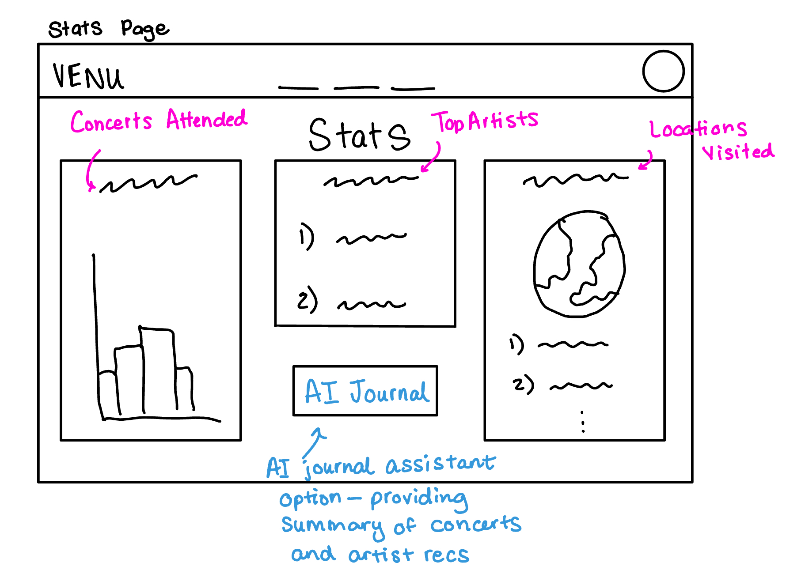
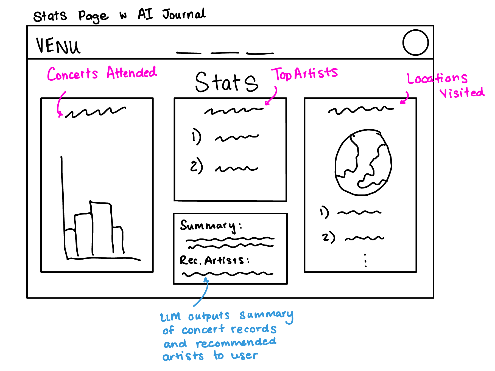

# JournalEntry

## Augment Design

**Original Concept**: ConcertStats [User]

**purpose** Provides each user with personalized statistics (concert streaks, artist counts, number of shows attended) and extends journaling structure

**principle** a user’s stats are automatically updated from their concerts to reflect up-to-date experience

**state**

a set of StatsRecord with

a totalConcerts Number

a currentStreak Number

a topArtists List

a journalEntries Set

**actions**

recordJournal (user: User, concert: ConcertEvent, text: String): (entry: JournalEntry)

**requires** concert exists and user in concert.attendingUsers

**effect** creates and saves a new JournalEntry for user linked to the concert

 

generateStats (user: User): (stats: StatsRecord)

**requires** user exists

**effect** computes user’s stats from their ConcertEvents and MediaAlbums and returns updated StatsRecord

 

**AI Augmented Concept**: ConcertStatsAI [User]

**purpose** Automatically summarizes a user’s concert history and generates personalized recommendations for future artists to see, enhancing self-reflection and discovery

**principle** Given a user’s concert log, the AI augmentation generates a structured text summary and artist recommendations based on user patterns, genres, and ratings

**state**

a set of concertRecord with

a userId String

an artist String

a venue String

a date String

an optional rating Number

 

a set of concertSummary with

a summary String

a set of String recommendations

**actions**

logConcert(userId, artist, venue, date, rating?)

**requires** concert exists and user in concert.attendingUsers

**effect** stores a new concert record for that user

 

generateSummaryAI(userId, llm, promptVariant?)

**requires** user has at least one logged concert

**effect** sends the user’s concert data to an LLM. The model summarizes concert trends (as one paragraph) and suggests 2–3 similar artists. It returns both a summary and recommendations array

 

getUserStats(userId)

**requires** user exists and has at least one logged concert

**effect** aggregates total concerts, unique artists, and average rating

## User Interaction

### User Sketches

### User Journey

A user enters the Venu app to see their concert stats page. Here they find their concerts attended, their top artists and the locations of venues they visited. Additionally they see the AI Journal button option. The user is interested in seeing a summary of their past concerts as well as artist reccomendations for future potential concerts. The user clicks on the AI Journal button and is provided a summary of past concert experiences and a reccomendation of future artists to see based on past events.

## Test Cases and Prompts

### Experiment 0 - Test Case 0 (test case 1):

**Approach**: In this experiment, the user logs 3 concerts: Coldplay, The 1975, Taylor Swift. The real LLM integration is tested and a baseline structured text prompt requests a paragraph summary and artist recommendations. From this test case a paragraph summary about the user’s concert style and 2–3 recommended artists is expected to be produced. This test case helps confirm that the AI augmentation (prompt, parser, and output display) works correctly under ideal conditions.

**What Worked**: The LLM integration was succesful and produced a reliable summary of the user's concert experiences including dates and ratings. The output also inlcuded relevant artist recommendations for future concerts based on past concert history.

**What Went Wrong**: The reccomendations might be too genre-specific which can be refined later to add a bias to other genres in order to balance out the reccomendations.

**Issues That Remain**: Since the LLM can make creative inferences, it might invent fake concert dates or venues, wrong artists (“You also attended Billie Eilish in 2023”), or overly specific ratings.

### Experiment 1 - Test Case 1 (test case 2):

**Approach**: In this experiment, a user has only logged one concert event. The system then attempts to generate an AI concert summary using a fake LLM that purposefully ignores the "Summary:" field and only returns recommendations. We do this to test the system’s validator behavior when the AI fails to produce the required Summary field.

**What Worked**: The validator successfully detected the missing summary and threw a controlled error message (Missing summary in LLM output), proving that the code enforces the required structure.

**What Went Wrong**: It is possible that the model may omit fields even with clear instructions in this case.

**Issues That Remain**: While the validator catches missing summaries, it doesn’t automatically retry or reformat the prompt to correct the issue. A future improvement could involve a recovery step that re-prompts the model for the missing field.

### Experiment 2 - Test Case 2 (test case 3):

**Approach**: A user logs one concert and the fake LLM is prompted to produce a noisy response with extra text before a valid JSON object. This test case uses the jsonNoise style prompt like {‘summary’: string, ‘recommendations’: string[]}”. This test case is used to see if the parser and validators can extract valid data from a noisy response that still includes usable JSON for the output.

**What Worked**: The test case validated parsing and displayed a correctly structured summary and recommendation list despite additional noise from the fake llm output.

**What Went Wrong**: If the JSON were malformed like if it was missing brackets or using smart quotes, parsing would fail. The current regex could also misfire if extra braces appear earlier in the output.

**Issues That Remain**: The validator only ensures syntactic correctness — it doesn’t verify that the JSON content matches logged concerts (risk of hallucinated or inaccurate summaries).

### Experiment 3 - Test Case 3 (test case 4):

**Approach**: A user logs one concert and the fake llm is prompted to produce a structured output following the summary and reccomended artists format as intended. This test case is used to verify that the model follows the explicit structured output format and that the parser extracts both the summary and recommendations properly.

**What Worked**: The structured variant produced readable summaries and recommendations that parsed correctly.

**What Went Wrong**: Even with explicit instruction to produce a paragraph, the model often produced a single sentence, indicating prompt sensitivity.

**Issues That Remain**: Models may interpret “paragraph” loosely; the parser does not enforce length or stylistic requirements. A potential mitigation is to include a short example in the prompt to illustrate the expected paragraph length.

## Validators

- Issue 1: The LLM could produce a missing summary or a summary that is too short. A validator that could be added to verify this is to check if the summary is empty or not the required length like in lines 153-154 which is tested in test case 2 with the missing summary. When a missing or underspecified summary is detected, this validator throws an error preventing incomplete or low-quality results from being displayed to the user.

- Issue 2: Another issue could be that the LLM produces the reccomended artists in a different format from the expected array of strings. A validator to ensure this is not the case would be to check the output is an array of strings as done in lines 155-156. If an error is thrown, a failure message is thrown instead of silently producing incorrectly formatted data.

- Issue 3: A final issue may be that the LLM produces a JSON output wrapped in additional text which would cause a parsing failure. The parsing validator is found in lines 112-147 where the regex is used to extract the first valid JSON object even if it’s preceded by unrelated text. This output is then validated and displayed to the user.
